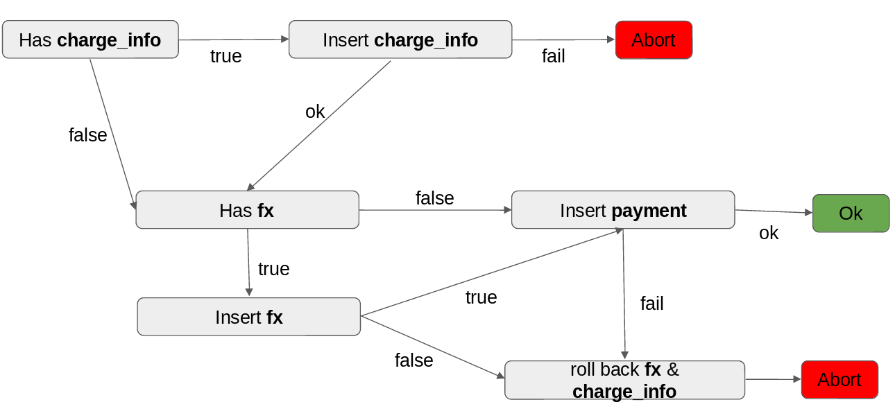
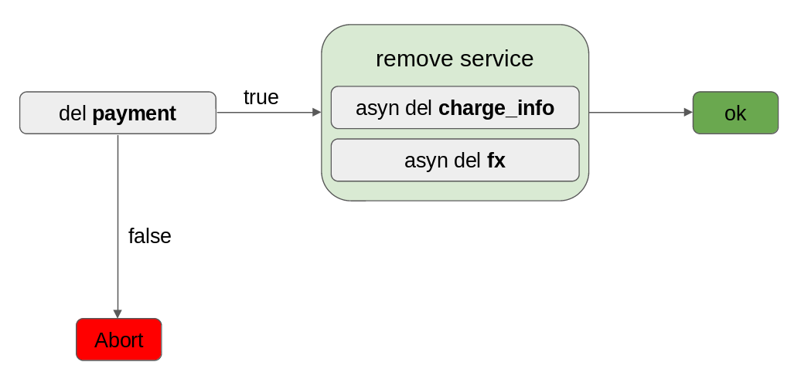

# Payment - API - MongoDB

A sample Payment API micro-service using Spring Boot, Data and MongoDB

## Design

### The entities diagram

### System components
  

**Security Layer** component is about authentication only at this point, later in this doc is explained a proposal to be implemented

**Async Remove** component is detailed later in this doc

#### like API Gateway

At gateway layer we perform some action; for example; coordinating the process of getting result, validation, security at authorization level, etc.

The **Security Filter** component is for authorization filter at this point, is *todo* in this sample

After passing the security layer, in this case, we call a validation service that tells the system if the Payment object for insert/update is valid for such operation.

The endpoints available now are:

**/payment/insert**  
 
**/payment/update**
   
**/payment/delete/{payment_id}**
   
**/payment/get/{payment_id}**
   
**/payment/list/{debtor}/{page}/{size}**  

##### The */payment/insert* endpoint needs explanation,

- Assumed in validation steps, the payment object is valid and their bank and bank_account dependencies exists.
  
- The payment objects *fx* and *charge_info* are new for each payment.
  
- Need to insert first payment dependencies to ensure consistency in payment.
   
- If some payment dependencies fail to insert, (i.e *charge_info*) we need to abort the operation and delete the other (ie *fx*) to keep those collection consistent.
  
- Also if the payment fails to insert we need to remove all dependencies (i.e *fx* and/or *charge_info*) from database.

##### The /payment/delete/{payment_id} endpoint

- Try to remove the payment using the *RemoveService*, explained later.
  
- If remove succeed we need to clean the *fx* and/or *charge_info*, also using the *RemoveService*. 

##### Remove Service

- Notice that for removal of documents in this system we use a centralized component *RemoveService*. That is because we give the chance to pick between:
	   
	- enforce removal synchronously  or  
	- assume the object is going to be removed asynchronously in some point
  
- This is useful in deletion of *fx* and *charge_info* because in those collections eventual consistency we think is good enough.
  
- In this way we allow, in case of fail of removal of a payment dependency the process continues and not block waiting to remove a document that is not in play like *fx* or *charge_info*.
  
- The asynchronous process that is not completed in this test needs to be at system level to ensure the warranties of success of removal is beyond the live of current node in microservice architecture.
  
- It could be another microservice or **Queue System** that process the removals until succeeds

### Security Proposal

- Client side credentials stored in cookies for web requests or using json token for communication between endpoints.
  
- Basically, we sign the credential-token using Public-Key cryptography and store the signed credential-token and the plain-text credential-token on client side.
  
- The credential-token should be also encrypted used Private-Key cryptography to avoid client see the content of their token.
  
- Then, for each request the system check that the credential-token is valid (signed by the system) and proceed to allow the user performs activities according to their role in the system.
  
- The credential token should contain information about the logged user like some id or login time for handling expiration or getting user authorities in the system.

